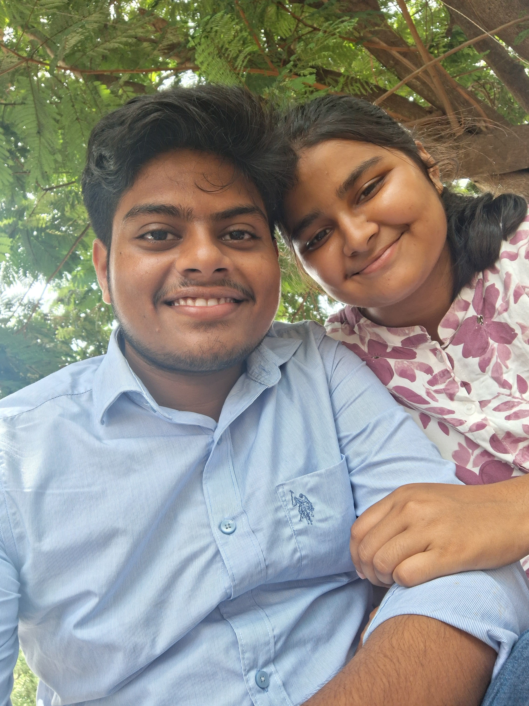
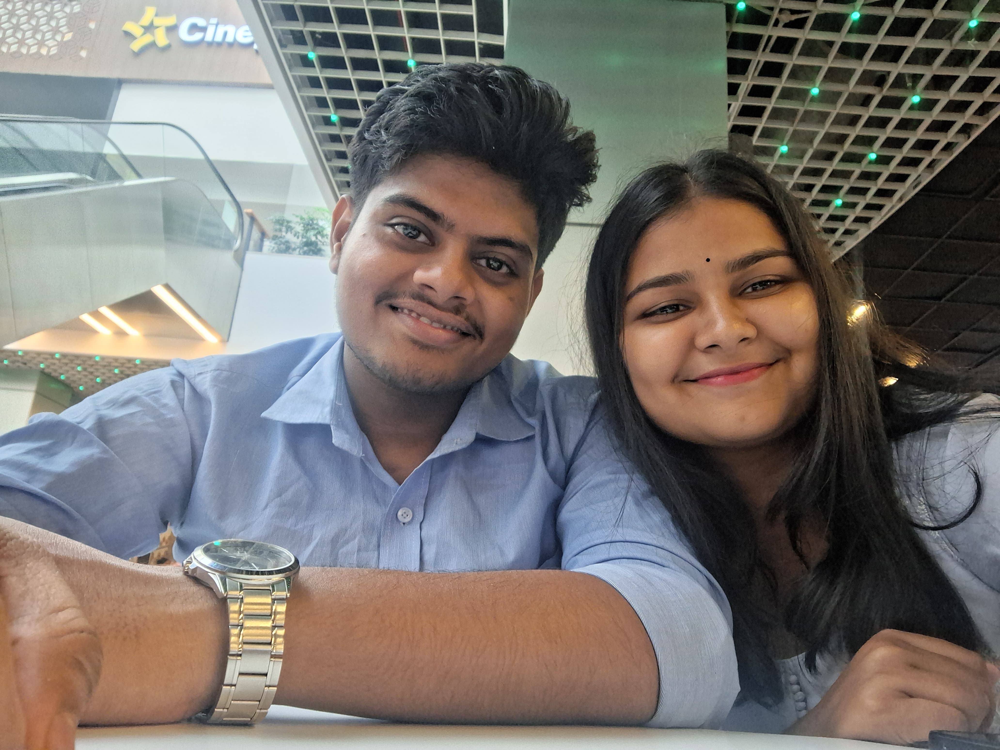
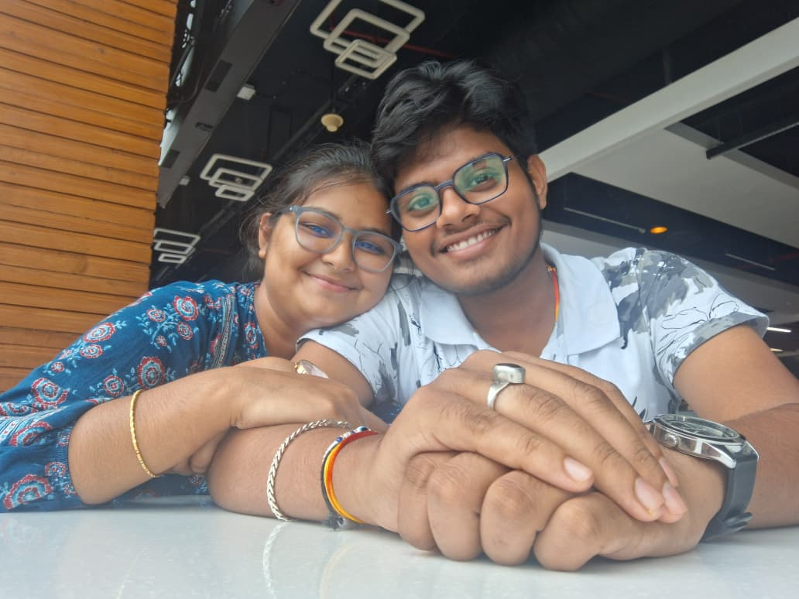
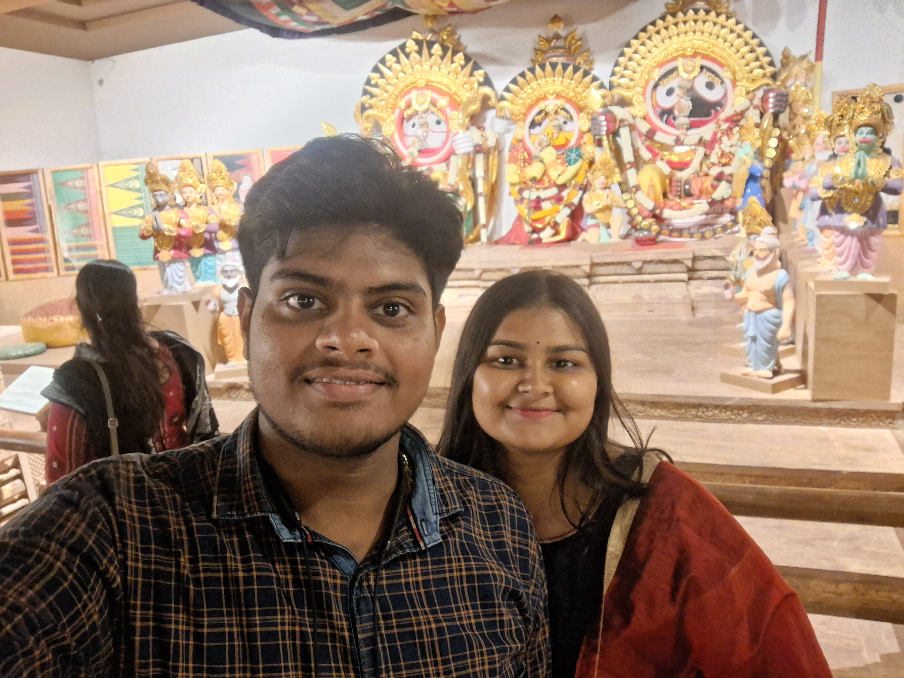
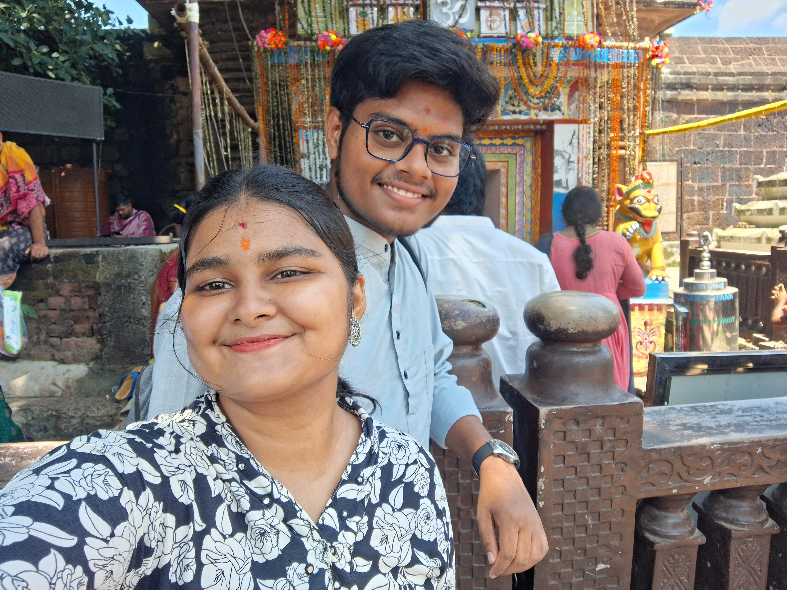
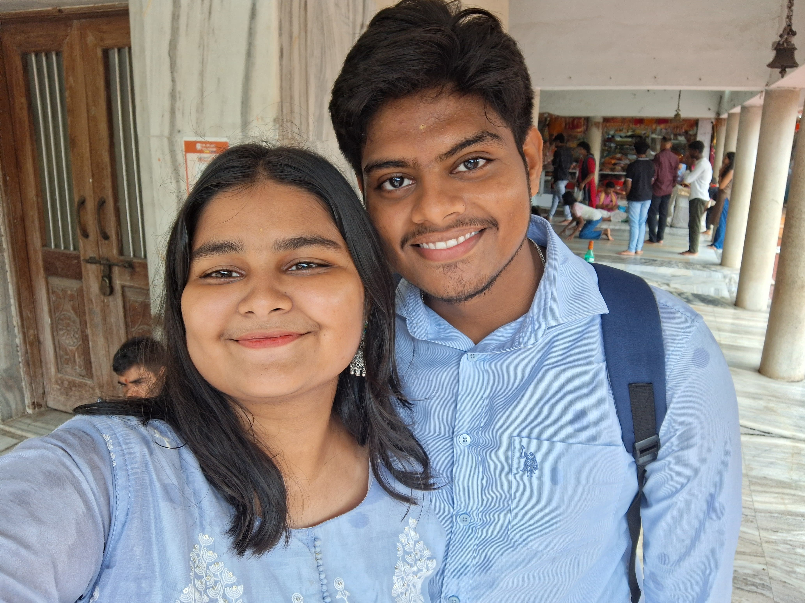
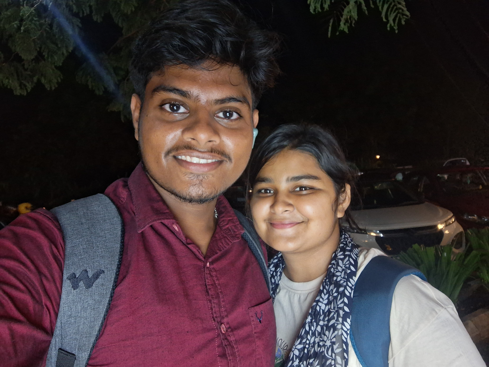

<!DOCTYPE html>
<html>
<head>
    <title>Happy Birthday my dear husband😘❤️🎂🍰</title>
</head>

<body style="text-align:center; background-color:#ffe6f0;">
    

    🎁 Tap to open surprise

    <h1>Happy Birthday My hero 🎉</h1>

    

    

        💖 Happy Birthday my hero 🎉❤️  

3 + 3 = 6, with you, my life is fixxxx😘😘😘😘😘😘😘😘 ♾️  

Wish you many more happy returns of the day, my swamiii 😘

Without you, my life feels boring 😴
On your special day, I thank God for blessing me with your presence in my life 🥰

You are my strength 💪 and my everything ❤️
No matter the distance, you are always in my heart ❤️  

To me, you are everything — father, brother, and mother too 💋
Thank you for your endless love, care, and always standing by my side 🫰🫂

That love is the special fuel that makes this long-distance worth every second 🥺  

I may call you my boyfriend, but in my heart, you are already my husband ❤️😘

Wishing you the happiest day and a year full of success 🤞🫂  
May God bring us together soon ❤️ and bless us with marriage

We have so many dreams to fulfill together ✨
You are also my 11:11 wish 🤞❤️

Love you so much, mo dhana 😘  
I have no words to describe u how much u love you 😘

God’s plan is always better than our dreams ❤️💖

Miss you so much, geluuuuu 🥺
On your birthday, you are not near me, and I miss you even more 🥺🥹😘 me being your wife is engough of a birthday gift ❤️🎂 and thanks for tolerating me daily ....😁 award milna chaiye tumhe😁😁  ... hapyyyyyyyy birthdayyyy dayyyyyyyy babyyyyyyyyy😘😘😘😘😘😘😘😘😘😘😘😘😘😘😘😘😘😘😘😘😘😘😘😘😘😘😘😘😘😘😘😘😘😘😘😘😘😘😘😘😘😘😘😘😘😘😘😘😘😘😘😘😘😘😘 pakhare thile infinity gelaaa karithanti 😘😘😘😘😘😘😘😘😘😘😘😘  
    

    

    <h2>Our Memories 📸</h2>

    
    
    
    
    
    
    
    
    

</body>
</html>
